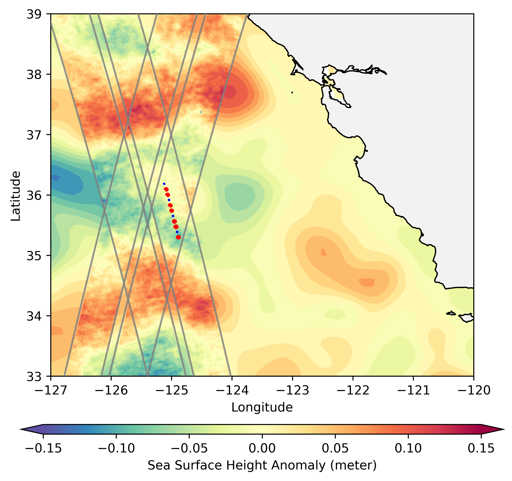

# swot-mission-validation-sub100km
This repository contains the code and data necessary to reproduce the analyses and figures presented in Wang et al. (2025).

In Wang et al. (2025), we conducted a validation analysis of sea surface height measurements obtained from the Ka-Band Interferometer (KaRIn) radar aboard the Surface Water and Ocean Topography (SWOT) mission satellite. SWOT is a pioneering mission that utilizes KaRIn for the first time to map the elevation of water surfaces, including both inland and oceanic waters. The mission's primary strength lies in its high precision and its wide-swath coverage of 120 km, with a 20 km gap at nadir. The mission's objectives for oceanography include measuring sea surface height for wavelengths under approximately 100 km in two dimensions. This documentation describes the validation process for the mission.




For validation, we used ground truth data derived from conventional in-situ mooring platforms and confirmed that KaRIn exceeded the mission's science requirements by at least a factor of four.

This code is designed to reproduce all the analyses and figures presented in the paper using published campaign data hosted by PO.DAAC. The analysis is divided into five main steps carried out by five main scripts:

- [0.plot_figure1.py](#plot-figure-1) produces the Figure 1. 
- [1.0.density_all_moorings_gliders_level-2.py](#1-calculate-density-anomaly) calculates density from temperature and salinity, derives density anomalies from the mean profile derived from S moorings, and saves all density into one netCDF file.  
- [2.0.calculate_steric_height.py](#2-calculate-steric-height) calculates steric height from density anomaly profiles generated by step 1.0. 
- [3.0.colocate.steric.karin.py](#3-colocate-steric-and-karin) colocates KaRIn and mooring with tunable parameters. 
- [4.0.process.colocated.data.py](#4-statistics) processes colocated data pairs and produces statiscal analyses and plots. 
- [5.0.wavenumber_spectrum.py](#5-wavenumber-spectrum) use the processed data pairs and conduct the wavenumber analysis. 


## Directory Structure

```markdown
   .
   ├── data/
   │   ├── NeurOST_SSH-SST_20230403_20240722.nc
   │   ├── SWOT_L2_LR_SSH_2.0_combined_calval_orbit_pass_013_sub_lat-30-40.nc
   │   ├── SWOT_L2_LR_SSH_2.0_combined_calval_orbit_pass_026_sub_lat-30-40.nc
   │   └── mooring_positions.csv
   |   ├── mooring.data/
   |   ├── density_all_moorings_level-2.nc
   ├── figures/
   │   ├── figure1_locations.png
   │   └── figure1_locations_zoom.png
   ├── utils.py
   └── main_script.py
```


### Input Data Files

Place the following data files in the `data/` directory:

- **NeurOST SSHA Data**: `NeurOST_SSH-SST_20230403_20240722.nc`
- **SWOT SSHA Data**:
  - `SWOT_L2_LR_SSH_2.0_combined_calval_orbit_pass_013_sub_lat-30-40.nc`
  - `SWOT_L2_LR_SSH_2.0_combined_calval_orbit_pass_026_sub_lat-30-40.nc`
- **Mooring Positions**: `mooring_positions.csv`

These data can be downloaded from the paper page on AGU website. 

## Rerun all scripts
```bash
    python 0.plot_figure1.py
    python 2.0.calculate_steric_height.py --bottom_depth=-500 --top_depth=0 --bottom_boundary_tolerance=80
    python 3.0.colocate.steric.karin.py --bottom_depth=-500 --top_depth=0
    python 4.0.process.colocated.data.py --bottom_depth=-500 --top_depth=0 --deltat_threshold=100 --valid_points=9
    python 5.0.wavenumber_spectrum.py --bottom_depth=-500 --valid_points=9
```
## Plot Figure 1
Create Figure 1. Campaign and mooring locations on a background of SSHA from NeurOST and SWOT KaRIn. 

### Usage

1. Ensure the input data files are in the `data/` directory.
2. Run the script to process the data and generate visualizations:

```bash
   python 0.plot_figure1.py
```

3. The output figures are saved in the `figures/` directory:
   - `figure1_locations.png`: Regional map with SSHA data and mooring positions.
   - `figure1_locations_zoom.png`: Zoomed-in map for details of the mooring positions.

4. Use photo editor such as Gimp to create the Figure 1 in Wang et al. (2025)
[Return to Top](#swot-mission-validation-sub100km)

## 1. Calculate density anomaly
- Script: **1.0.density_all_moorings_gliders_level-2.py**

This script calculates the density from moorings and gliders, combines them into one file, removes outliers, and saves the resulting data.

Unless you want to recaculate from the source data on PO.DAAC, this script can be skipped. The data produced by this script is the fundation of all following analysis and can be downloaded from AGU website. Details can be found in the Supplemental Materials. 

- **Input**
 * Level-2 mooring data. 
- **Output**
 * A single netCDF file containing all processed data `../data/mooring.data/density_all_moorings_level-2_removed_outliers.nc`. This is the input file for [step 2](#2-calculate-steric-height). 

### Process

1. **Moorings**
	* Open input files and extract relevant variables (temperature, salinity, pressure, density)
	* Calculate seawater density using the `c_rho` function
	* Create a new dataset with the calculated densities
2. **Gliders**
	* Open input files and extract relevant variables (pressure, temperature, salinity, density)
	* Apply outlier removal to each profiler on each mooring (using the `remove_outliers` function)
3. **Removing Outliers**
	* Apply a 5-sigma rule to detect outliers in the density data at each depth with 5-m bin size. 
4. **Combining Data**
	* Combine the processed mooring and glider data into a single dataset using the `xr.Dataset` class
5. **Saving Output**
	* Save the combined dataset to disk as a new netCDF file (`fn_out`)

## 2. Calculate Steric Height 
- Script: **2.0.calculate_steric_height.py**

This script calculates the steric height from the mooring and glider density anomaly profiles. It uses various functions to process the data, remove spikes, and calculate the steric height.

Example usege:

```bash
python 2.0.calculate_steric_height.py --bottom_depth=-500 --top_depth=0 --bottom_boundary_tolerance=80
```

### Parameters Used

* `bottom_depth=-500`: bottom depth for steric height calculation
* `top_depth=0`: top depth for steric height calculation
* `max_spacing=10`: minimum gap threshold for identifying a good profile
* `time_span_minimum=10 * 60`: minimum time span for steric height calculation
* `time_span_maximum=120 * 60`: maximum time span for steric height calculation
* `rho0=1027.5`: density at sea level
* `surface_time_depth=-100`: depth range between surface_time_depth and surface used to estimate mean time
* `bottom_boundary_tolerance=10`: maximum depth gap on the edge of profiles at the bottom. Set to 80 meters because P moorings do not go as deep as 500 m. Extrapolation was used to fill ~420-500m depth range in P moorings. Errors are introduced by this extrapolation but considered tolerable shown by the final results. 
* `top_boundary_tolerance=10`: maximum depth of the shallowest measurement. 
* `surface_depth=-8`: the depth of the surface layer, in which density will be replaced by the median of the layer. This mitigates the outliers in the thin upper layers. 

The paper used the following parameters:

```markdown
bottom_depth=-500
top_depth=0
bottom_boundary_tolerance=80
```
All other parameters use default values. 

### Functions

* `despike_profile(x, y, sigma=5)`: removes spikes from a profile
* `remove_spikes(df, sigma=5, varname='steric')`: removes spikes from a time series in a pandas DataFrame
* `calculate_steric_height_from_profile(depth, density, time, integration_depth=[-500, 0], ...)`:
	+ calculates the steric height from a profile
	+ uses the `despike_profile` function to remove spikes
	+ uses the `remove_spikes` function to remove spikes from the data
* `process_glider(glider_name, ...)`: processes glider data and returns a pandas DataFrame with the steric height
* `calculate_mooring_steric(time, data, mooring_name, ...)`: calculates the steric height from a mooring profile
* `remove_spikes(df)` (called by `calculate_mooring_steric`): removes spikes from a time series in a pandas DataFrame

### Output

The script saves the results to CSV files following the format:

* `../data/rutgers/ru32_ru38_steric_heights_depth_{-bottom_depth:3d}.csv`
* `../data/mooring.data/all_mooring_steric_heights_depth_{-bottom_depth:3d}.csv`

Given bottom_depth=-500, the two output files are 
* `../data/rutgers/ru32_ru38_steric_heights_depth_500.csv`
* `../data/mooring.data/all_mooring_steric_heights_depth_500.csv`

These files contain the steric height and auxillary information for each profiles. The following shows a snippet of the csv data file. 

#### Sample Data

| lat  | lon   | time_min | time_max | surface_time | depth_min | depth_max | num_points | steric | Mooring_ID |
| --- | --- | --- | --- | --- | --- | --- | --- | --- | --- |
| 36.1798 | -125.1268 | 5354727.0000 | 5355523.5000 | 5355434.0000 | -494.8176 | -4.2868 | 1593.0000 | 52.9755 | S1 |
| 36.1813 | -125.1264 | 5356514.5000 | 5357263.5000 | 5357178.0000 | -496.2219 | -4.7206 | 1494.0000 | 52.1012 | S1 |
| 36.1825 | -125.1261 | 5358204.5000 | 5358941.0000 | 5358857.0000 | -495.5951 | -4.6571 | 1472.0000 | 52.1746 | S1 |
| ...   | ...   | ...       | ...      | ...        | ...     | ...    | ...     | ...    | S1 |
| 36.1841 | -125.1265 | 5363242.0000 | 5363984.0000 | 5363897.0000 | -496.2865 | -4.4438 | 1486.0000 | 50.5210 | S1 |

| **Column Name** | **Data Type** | **Description** |
| --- | --- | --- |
| `lat` | float64 | Latitude values |
| `lon` | float64 | Longitude values |
| `time_min` | int64 | Minimum time values, seconds since 2023-01-01 |
| `time_max` | int64 | Maximum time values, seconds since 2023-01-01 |
| `surface_time` | int64 | Surface time values averaged between surface and a depth set by the parameter surface_time_depth (default -100 m). I used the upper 100 m average time to represent the time of the profile to account for surface-intensified small-scale signal. This time stamp will be used to match SWOT flyover time.  seconds since 2023-01-01 |
| `depth_min` | float64 | Minimum depth values |
| `depth_max` | float64 | Maximum depth values |
| `num_points` | int64 | Number of points in each profile |
| `steric` | float64 | Steric height values (in meters) |
| `Mooring_ID` | object | Mooring ID values |

[Return to Top](#swot-mission-validation-sub100km)

## 3. Colocate Steric and KaRIn
- **3.0.colocate.steric.karin.py**

This script aligns steric height points (spatially sparse, temporally dense) with SWOT Karin data (spatially dense, temporally sparse). It performs data cleaning, subsetting, interpolation, and saves the output in a structured format.

```bash
python 3.0.colocate.steric.karin.py --bottom_depth=-500 --top_depth=0
```
### The script does the following
1. **Cleans and pre-processes steric data**: Removes missing values and sorts by time.
2. **Loads SWOT Karin data**: Reads data within specified latitude and time ranges, and applies masks to remove bad data.
3. **Interpolates steric data**: Aligns steric height data with SWOT Karin data spatially and temporally.
4. **Handles multiple passes**: Supports processing for specific SWOT orbit passes.
5. **Exports results**: Saves the co-located data to a CSV file using Pandas.

### Input data

- Steric height 
    * Produced by the second step [2.0.calculate_steric_height.py](#calculate-steric-height).
    * `../data/rutgers/ru32_ru38_steric_heights_depth_{-args.bottom_depth:3d}.csv`
    * `../data/mooring.data/all_mooring_steric_heights_depth_{-args.bottom_depth:3d}.csv`
- SWOT Karin
    * The data are located in `../data/`
    * `../data/SWOT_L2_LR_SSH_2.0_combined_calval_orbit_pass_013_sub_lat-30-40.nc`
    * `../data/SWOT_L2_LR_SSH_2.0_combined_calval_orbit_pass_026_sub_lat-30-40.nc`

### The output 

 The output is saved in 
 
 `../data/colocated_data_karin_moorings_gliders_depth_{-args.bottom_depth:3d}.csv`


Example:

| lat      | lon      | time_min   | time_max   | surface_time | depth_min | depth_max | num_points | steric  | Mooring_ID |
| --- | --- | --- | --- | --- | --- | --- | --- | --- | --- |
| 36.1798  | -125.1268| 5354727.0000| 5355523.5000| 5355434.0000 | -494.8176 | -4.2868   | 1593.0000  | 52.9755 | S1         |
| 36.1813  | -125.1264| 5356514.5000| 5357263.5000| 5357178.0000 | -496.2219 | -4.7206   | 1494.0000  | 52.1012 | S1         |
| 36.1825  | -125.1261| 5358204.5000| 5358941.0000| 5358857.0000 | -495.5951 | -4.6571   | 1472.0000  | 52.1746 | S1         |
| ...      | ...      | ...        | ...        | ...          | ...       | ...       | ...        | ...     | ...        |
| 36.1841  | -125.1265| 5363242.0000| 5363984.0000| 5363897.0000 | -496.2865 | -4.4438   | 1486.0000  | 50.5210 | S1         |


### Key Functions

* **mask_bad_karin(kk)**

- Removes bad SWOT Karin data based on RMS (Root Mean Square) values.
- Plots the RMS values and displays the data for visual inspection.

* **colocate(karin_fn, steric)**

    - **Inputs**:
     - `karin_fn`: Path to the SWOT Karin data file.
     - `steric`: Steric height dataset from moorings and gliders. These data are produced by [2.0.calculate_steric_height.py](#calculate-steric-height).

    - **Process**:
        1. Filters steric data to remove missing values. 
        2. Loads SWOT data and subsets it by latitude and time.
        3. Interpolates steric height data to SWOT Karin data's spatial and temporal resolution.
        4. Handles individual mooring IDs and interpolates data for each.

    - **Output**:
    - A concatenated DataFrame of co-located data for all moorings and gliders.


[Return to Top](#swot-mission-validation-sub100km)

## 4. Statistics
- **4.0.process.colocated.data.py**
This script includes a series of functions for processing, selecting, and analyzing colocated data between steric and KaRIn. The analysis involves removing linear trends in space and time, selecting valid data based on time and spatial criteria, and visualizing various aspects of the colocated data. Below is a description of each function and its purpose.

### Example use:

```bash
    python 4.0.process.colocated.data.py -500 0 100 9
```

```markdown
    Parameters:
    -500   : Integration depth at the bottom of the water column (in meters).
    0      : Integration depth at the top of the water column (in meters).
    100    : Maximum allowable time difference between steric (mooring profile) and SWOT flyover time (in minutes).
    9      : Minimum number of valid points required to remove trends. Default is 5; 
             any snapshot with fewer than 5 points will be dropped.
```

### Input 

- The csv file produced by the third step 
```markdown
../data/colocated_data_karin_moorings_gliders_depth_{-args.bottom_depth:3d}.csv
```

### Output

- The output is saved to 

```markdown
  ../data/4.0.colocated_data_karin_moorings_gliders_depth_{-args.bottom_depth:3d}.valid_points.{valid_points:02d}.deltat_{deltat_threshold:03d}m.clean.csv
```

Example:

| **time_karin** | **lon**     | **lat**    | **time_delta_left** | **time_delta_right** | **ssha_karin**      | **steric** | **steric_linear**   | **swh**  | **pass_num** | **mooring_id** |
|----------------|-------------|------------|----------------------|-----------------------|---------------------|------------|---------------------|----------|-------------|----------------|
| 7892017.0      | -125.122    | 36.1864    | -31.41667           | 0.8                  | 0.8614519029724665  | 53.5223    | 1.0026886874165344  | 1.24138  | 13.0        | S1             |
| 7892017.0      | -125.0642   | 36.0231    | -96.28333           | 39.55                | 0.28985193243691365 | 53.812     | 0.335874731568603   | 1.22698  | 13.0        | P2             |
| 7892017.0      | -125.0444   | 35.9205    | -0.76667            | 34.83333             | -0.4251734271795222 | 52.6694    | -0.830690943385294  | 1.21972  | 13.0        | S2             |
| 7892017.0      | -125.0347   | 35.8467    | -24.3               | 41.03333             | -0.8776541701424689 | 51.6737    | -0.6379694699829103 | 1.2167   | 13.0        | P3             |
| 7892017.0      | -124.98     | 35.6557    | -9.26667            | 27.68333             | -0.7914287090493992 | 52.2395    | -1.0163700968681446 | 1.19866  | 13.0        | S3             |
| 7892017.0      | -124.9502   | 35.4759    | -99.48333           | 36.38333             | -0.3845929904770151 | 50.3547    | -0.10730154753787652| 1.18777  | 13.0        | P6             |
| 7892017.0      | -124.9088   | 35.3901    | -17.9               | 15.23333             | 1.327545461439023   | 53.2169    | 1.2537686387890892  | 1.1809   | 13.0        | S4             |
| 7977854.0      | -125.1242   | 36.1853    | -2.3                | 24.26667             | 0.3792522432655523  | 53.1642    | -0.35590908346390615| 2.85409  | 13.0        | S1             |


| **Field**                | **Description**                                                                                                           |
|--------------------------|---------------------------------------------------------------------------------------------------------------------------|
| `time_karin`             | Timestamp of SWOT data. Seconds since 2023-01-01                                                                         |
| `lon`, `lat`             | Longitude and latitude of the co-located data point (from moorings).                                                     |
| `time_delta_left`        | Time separation between SWOT pass and available steric data before the SWOT pass time (minutes).         |
| `time_delta_right`       | Time separation between SWOT pass and available steric data after the SWOT pass time (minutes).                |
| `ssha_karin`             | Co-located SWOT sea surface height anomaly.                                                                              |
| `steric`, `steric_linear`| Steric height from moorings or gliders (nearest and linear interpolations), with quality control using `time_delta` values to exclude separations over 100 minutes on either side.                                                                  |
| `swh`                    | Significant wave height (m).                                                                                                 |
| `pass_num`               | SWOT orbit pass number.                                                                                                  |
| `mooring_id`             | Mooring or glider identifier (`S1`, `P1`, `P2`, `S2`, `P3`, `P4`, `S3`, `P5`, `P6`, `S4`, `P7`, `ru32`, `ru38`).         |


### Functions

1. **remove_trend(data, var_name, valid_points=5, temporal=True, spatial=True)**
   
   Removes the linear trend from the specified variable in the input data. The trend can be removed both temporally (along the time axis) and spatially (along the latitude). It handles missing values (NaNs). 
   
   Parameters:
   - `data`: A pandas DataFrame containing the data to be processed.
   - `var_name`: The name of the variable for which the trend is to be removed (e.g., 'steric_linear').
   - `valid_points`: Minimum number of valid points required to remove the trend.
   - `temporal`: Whether to remove the temporal trend (default is True).
   - `spatial`: Whether to remove the spatial trend (default is True).
   
   Returns:
   - The data with trends removed.

1. **select_along_karin_swath_center(df, dis=0.025)**
   
   Selects data points along the center of the SWOT satellite swath. The distance between the data points and the swath center is evaluated, and only those points within a given distance are selected. It is useful to select the gliders near the swath centers. It does not affect mooring data selection. 
   
   Parameters:
   - `df`: The input DataFrame containing the data to be processed.
   - `dis`: The maximum distance to the SWOT swath center, in degrees.
   
   Returns:
   - The subset of data points that are within the specified distance from the SWOT track.
   - The longitude and latitude of the SWOT track.

3. **select_colocated_data(dd, max_deltat_left, max_deltat_right, distance_to_center)**
   
   Selects colocated data based on criteria including maximum time difference between two datasets (steric and Karin) and the maximum distance to the center of the SWOT swath. This function filters the data according to the provided thresholds.

   Parameters:
   - `dd`: The input DataFrame with colocated data.
   - `max_deltat_left`: The maximum allowed time difference between SWOT time and the nearest mooring profile to the left (in minutes).
   - `max_deltat_right`: The maximum allowed time difference between SWOT time and the nearest mooring profile to the right (in minutes).
   - `distance_to_center`: The maximum allowed distance to the center of the SWOT swath (in degrees).

   Returns:
   - A DataFrame containing the selected colocated data.
   - Longitude and latitude of the SWOT track.

4. **plot_locations(dd, max_deltat_left=60, max_deltat_right=60, distance_to_center=0.02)**
   
   Plots the locations of the colocated data points, color-coded by their source (e.g., glider, P mooring, S mooring). The function also plots the positions of the SWOT satellite's swath.

   Parameters:
   - `dd`: The input DataFrame with colocated data.
   - `max_deltat_left`: The maximum time difference for data selection.
   - `max_deltat_right`: The maximum time difference for data selection.
   - `distance_to_center`: The maximum distance from the SWOT swath center.

   Returns:
   - A figure with the plotted locations of the colocated data and SWOT track.

5. **plot_latitudes(dd, max_deltat_left=60, max_deltat_right=60, distance_to_center=0.025)**

   Plots the latitudes of the colocated data over time. This helps in visualizing the temporal distribution of the data points.

   Parameters:
   - `dd`: The input DataFrame with colocated data.
   - `max_deltat_left`: The maximum time difference for filtering.
   - `max_deltat_right`: The maximum time difference for filtering.
   - `distance_to_center`: The maximum distance from the SWOT swath center.

   Returns:
   - A figure showing the latitudes of the colocated data over time.

6. **plot_profiles_space(dd, var_name='steric_linear')**

   Plots the spatial profiles of the colocated data for the specified variable. The spatial profiles are plotted for each unique time point in the dataset.

   Parameters:
   - `dd`: The input DataFrame with colocated data.
   - `var_name`: The name of the variable to plot (e.g., 'steric_linear').

   Returns:
   - A figure with the spatial profiles of the colocated data.

7. **plot_time_series(data0, var_name)**

   Plots time series of the mooring steric height and SWOT KaRIn SSHA.

   Parameters:
   - `data0`: The input DataFrame with colocated data.
   - `var_name`: The name of the variable to plot (e.g., 'steric_linear').

   Returns:
   - A figure with the time series plots for each mooring ID.

8. **error_stats(data, var_name, plotit=False)**

   Calculates error statistics (mean absolute difference, standard deviation, and RMSD) between the steric and SWOT data. Optionally, it also plots the error statistics.

   Parameters:
   - `data`: The input DataFrame with colocated data.
   - `var_name`: The name of the variable to compute statistics for (e.g., 'steric_linear').
   - `plotit`: Whether to plot the error statistics (default is False).

   Returns:
   - A DataFrame with the error statistics for each mooring.

9. **loop_over_parameters_for_stats()**

   Loops over various parameter combinations (e.g., depth, valid points, and time difference thresholds) to compute the colocated data statistics and save the results.

[Return to Top](#swot-mission-validation-sub100km)

## 5. Wavenumber Spectrum 
- Script: **5.0.wavenumber_spectrum.py**

This script computes the final wavenumber spectrum of the mooring steric height (steric) and Karin SSHA and their difference. The wavenumber spectrum can be calculated using the Welch method and Lomb-Scargle periodogram (LS) for comparison. Resutls using LS are used in the paper. 

The script takes the cleaned data from step 4.

### Input
```markdown
  ../data/4.0.colocated_data_karin_moorings_gliders_depth_{-args.bottom_depth:3d}.valid_points.{valid_points:02d}.deltat_{deltat_threshold:03d}m.clean.csv
```

Given the parameters used in the paper: bottom_depth=-500, valid_points=9 and deltat_threshold=100. The input file is 
```markdown
  ../data/4.0.colocated_data_karin_moorings_gliders_depth_500.valid_points.09.deltat_100m.clean.csv
```
### Output
- The final wavenumber spectrum figure. 


### Key Functions
- `spectrum_karin_swath_center` calculate the spectrum of the KaRIN SSHA on the original 2 km posting. 
- `wavenumber_spectrum` calculates the wavenumber spectrum of a variable using either the `interpolate` or `lombscargle` method. 
- `plot_spectrum` generates a log-log plot of the wavenumber spectrum for both steric, Karin SSHA, and their differences.


Example Usage
---------------
```bash
python 5.0.wavenumber_spectrum.py --bottom_depth=-500 --valid_points=9
```
The spectrum plot is saved to the `../figures` directory.

[Return to Top](#swot-mission-validation-sub100km)
